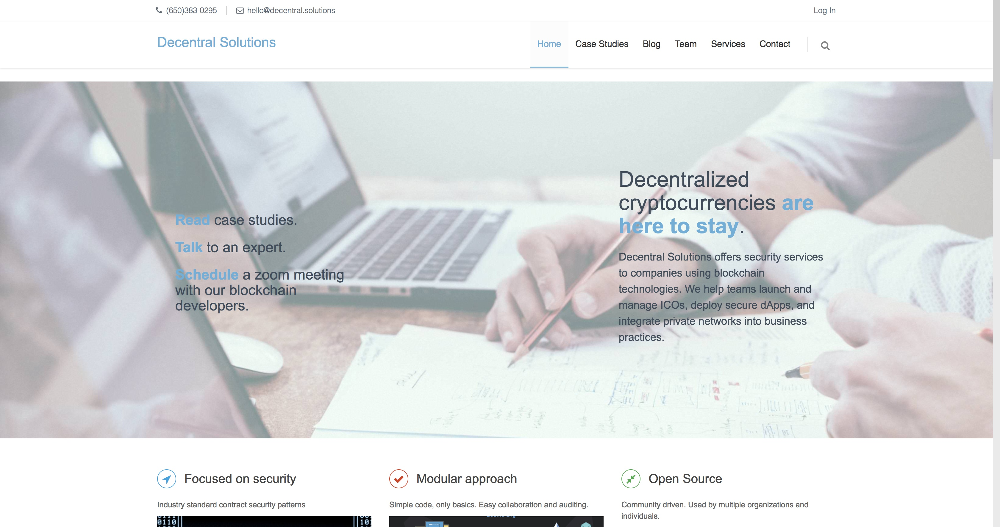

# Decentral

Theme for the company website

This theme is based on Hexo Corporate.
[Link](http://hexotest.computerlab.io) | [Source](https://github.com/ptsteadman/hexo-theme-corporate-example)



**Features:**

- custom landing page / index
- blog posts with tags and categories
- project portfolio
- contact form with google maps
- about page
- swiftype (search) integration
- multiple color schemes
- disqus integration
- social links
- metronic css framework components

## Install

```bash
git clone https://github.com/decentral-inc/decentral.git themes/decentral
```

## Enable

1.  **Add example pages.**

    Copy all of the contents of `themes/decentral/_source` to `source`.
    This includes a sample landing page and contact, project, and
    about pages.

    ```bash
    cp -r themes/decentral/_source/* source
    ```

2.  **Enable theme.**
    Modify the root site `_config.yml` so that `theme` is set to `decentral`.

    ```yml
    # Extensions
    ## Plugins: http://hexo.io/plugins/
    ## Themes: http://hexo.io/themes/
    theme: decentral
    ```

# Extensions

## Plugins: http://hexo.io/plugins/

## Themes: http://hexo.io/themes/

theme: decentral

    ```

    Finally, run `npm install` and then `hexo server` to test out the site.

3.  **Optional: Enable custom landing page.**

    To use custom landing page instead of the default archive index, remove
    the line containing hexo-generator-index from package.json in the project root.
    Then, edit `source/index.ejs`.

### Update

```bash
cd themes/decentral
git pull
```

## Configure

Edit `themes/decentral/_config.yml` for theme-specific configuration.

```yml
# Header Menu
menu:
  Home: /
  Case Studies: /tags/Case-Studies/
  Blog: /blog/ # can set archive-dir in root config to custom value
  Team: /team/
  Services: /services/
  Contact: /contact/

rss: /atom.xml

# Content
excerpt_link: Read More
fancybox: true # whether or not to load the fancybox library

# Integrations
disqus_shortname:
google_analytics:
swiftype_install_key:

# Social
social:
  github: https://github.com/decentral-inc/
  twitter: https://twitter.com/lingqingmeng
  facebook: https://www.facebook.com/decentralsolutions
  rss: atom.xml
  linkedin: https://www.linkedin.com/company/decentral-solutions/
  stackoverflow: https://stackoverflow.com/users/2163873/ling-qing-meng

# Miscellaneous
color_scheme: blue   # options: blue, gray, green, orange, red, turquoise
favicon: /favicon.ico # path from root of hexo site
twitter_widget_id: "947183761371807744" # as a string, from https://twitter.com/settings/widgets
twitter_username: lingqingmeng # twitter username without the @
default_author: Anonymous

about: Decentral Solutions © offers security services to companies using blockchain technologies. We help teams launch and manage ICOs, deploy secure dApps, and integrate private networks into business practices.<br><br> Our team has roots in traditional cybersecurity, originally consulting to large international institutes, ranging from the financial to healthcare sector. In addition each partner brings domain expertise in the fields of distributed systems, network architecture, scalability, and latest methodologies in frontend development. <br><br> We understand the emerging threats that companies face in the unregulated and high value space of cryptocurrencies. Our solutions are crafted to address these issues in the most effective ways possible. <br><br>
phone: (650)383-0295
email: hello@decentral.solutions
address_1: 1489 Webster St
address_2: 6th Floor
address_3: San Francisco, CA 94115
skype: video@decentral.solutions
lat: 37.783953
long: -122.431967
```

## Features

### Custom Pages

Contact, Projects, and About pages are included in the theme's `_source` directory.
When copied to the blog's `source` directory, they can be edited with your custom content.
Edit the header menu in the themes `_config.yml` to create links to these pages.

You can use [metronic CSS components](http://keenthemes.com/metronic-theme/) to build these pages.

```yml
# Header Menu
menu:
  Home: /
  Projects: /projects/
  Blog: /archives/ # can set archive-dir in root config to custom value
  Contact: /contact/
  About: /about/
```

### Swiftype

You enable **Swiftype** search funcationality by editing the theme's `_config.yml`.

```yml
swiftype_install_key: XXX_XXXXXXXXXXXXXXXX
```

This `install key` can be found at your own engine's install page:


Finally, don't forget to save your swiftype configuration to complete the installation.

### Thumbnail

Set `thumbnail` in post frontmatter to display an image on the blog/archive page:

    thumbnail: https://s3.amazonaws.com/ptsteadman-images/nginx-proxy.png

### Lede

Set `lede` in post frontmatter to display a custom bit of text distinct from an excerpt:

    lede: "This text will appear by the thumbnail in the blog page."

### Author

Set `author` in post frontmatter to display an author's name. Set `default_author` in the
site's `_config.yml` to determine author if the frontmatter value is not set.

    author: "Patrick Steadman"

### Color Schemes

Hexo Corporate has multiple color schemes, including:

- red
- gray
- green
- orange
- blue
- turquoise

### Fancybox

Hexo Corporate uses [Fancybox] to showcase your photos. You can use Markdown syntax or fancybox tag plugin to add your photos.

```



```

## Metronic Freebie License

The Metronic CSS and JavaScript components are included with the following
license:

```
You are free to use this freebie theme in your any personal or commercial
projects. All used resources, plugins, stock images are subject to thier own
licenses!

The only limitation is that you are not permitted to use this theme in a stock
items that sold in any theme marketplaces(e.g: themeforest.net,
wrapbootstrap.com, etc...).
```
